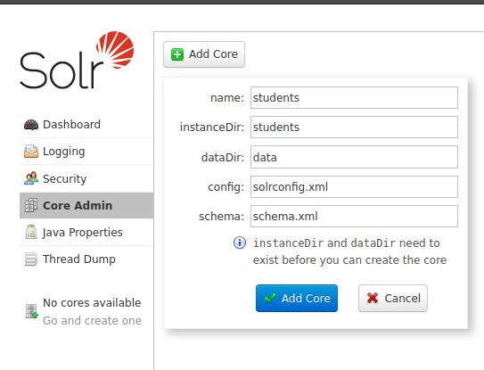
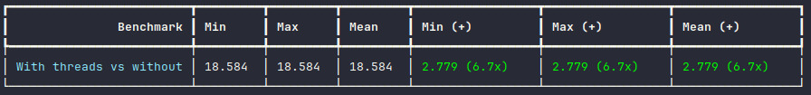

# UBC_Challenge: Desafio Técnico para importação de Dados para o Solr

- Formatar o CSV
  - O script deve ler um arquivo CSV fornecido e realizar a formatação dos dados para garantir consistência e correção.
  - Considere que o arquivo CSV pode conter campos mal formatados, dados ausentes ou outros problemas típicos em conjuntos de dados do mundo real.
   
- Inserir no Solr:
  - Após a formatação, o script deve inserir os dados no Apache Solr.]
  - Certifique-se de mapear corretamente os campos do CSV para os campos correspondentes no esquema do Solr.

- Pontos Extras:
  - Lidar com situações de erro durante a formatação e inserção no Solr.
  - Implementar logs adequados para rastrear o progresso e eventuais problemas.
  - Garantir que o script seja eficiente, mesmo para grandes conjuntos de dados.


## Dependências
- Docker
- Docker Compose
- Python

## SOLR
Para iniciar o container do Solr, utilize o comando:
```
docker compose up
```
### Acesse a Interface do Solr Admin

Após subir o container, acesse a Solr Admin Interface em http://localhost:8983/solr.

#### Crie o core


## Rodar o projeto:

#### Para executar o projeto, siga os passos abaixo:

- Instale as dependências utilizando o comando:
```
pip install -r requirements.txt
```

- Utilize o comando para rodar o projeto:
```
python main.py
```


## Benchmarks

- Para rodar o teste de benchmark, utilize o comando:

```
richbench --repeat 1 --times 1 benchmarks/
```

